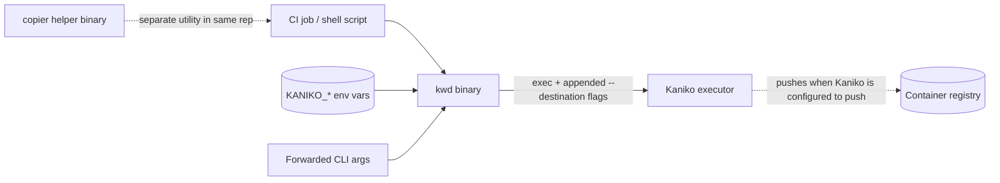
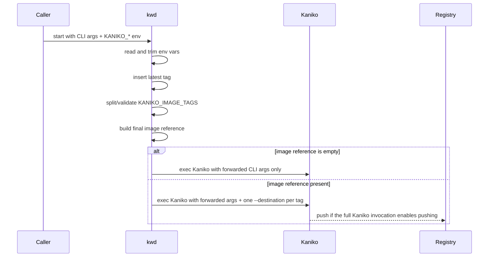

# kwd [![Crates.io][crates-badge]][crates-url] [![hub.docker.com][docker-badge]][docker-url] [![MIT licensed][mit-badge]][mit-url]

[crates-badge]: https://img.shields.io/crates/v/kwd.svg
[crates-url]: https://crates.io/crates/kwd
[mit-badge]: https://img.shields.io/badge/license-MIT-blue.svg
[mit-url]: https://github.com/spi-ca/kwd/blob/main/LICENSE
[docker-badge]: https://img.shields.io/docker/v/sangbumkim/kwd
[docker-url]: https://hub.docker.com/r/sangbumkim/kwd

## Overview

`kwd` is a small Kaniko wrapper that turns one build invocation into Kaniko arguments for multiple destinations.
It reads a few `KANIKO_*` environment variables, generates one `--destination=` flag per accepted tag, then `exec`s the Kaniko binary with your original CLI arguments plus the generated destinations. Whether an image is actually pushed is still decided by Kaniko and the full set of arguments you pass to it.

This repository also ships a separate `copier` helper binary for file copying with permission and accessed/modified time preservation.

## Project contract

- `kwd` does not build images itself; it only prepares Kaniko arguments and replaces itself with the Kaniko process.
- User-supplied CLI arguments are forwarded as-is.
- Generated `--destination=` flags are appended after the forwarded arguments.
- `KANIKO_*` variables consumed by `kwd` are removed from the environment before Kaniko starts.
- A `latest` tag is always included when `kwd` emits destinations.
- Tag ordering is not stable because tags are stored in a `HashSet`.

## Documentation map

- `README.md` - project contract, runtime behavior, and embedded diagrams
- `docs/diagrams/component.mmd` - reusable Mermaid source for the component view
- `docs/diagrams/sequence.mmd` - reusable Mermaid source for the execution flow
- `docs/diagrams/mermaid-config.json` - shared Mermaid rendering config

## How `kwd` builds destinations

`kwd` derives the image reference like this:

1. Read `KANIKO_IMAGE_REPOSITORY`, trim whitespace, then remove trailing `/`.
2. Read `KANIKO_IMAGE_NAME`, trim whitespace, then remove leading `/`.
3. Join them with a single `/` and trim leading or trailing `/` from the final result.
4. If the final image string is empty, `kwd` adds no `--destination` flags.
5. Otherwise, `kwd` adds one `--destination=<image>:<tag>` argument for every accepted tag.

`KANIKO_IMAGE_TAGS` is split on commas. Each entry is trimmed, validated against `^[-a-zA-Z0-9_\.]+$`, and silently ignored if invalid. `latest` is always inserted even when `KANIKO_IMAGE_TAGS` is unset or empty.

## Environment variables

| Variable | Default | Behavior |
| --- | --- | --- |
| `KANIKO_BIN` | `/kaniko/executor` | Path to the Kaniko executable. The value is trimmed and then removed from the environment before `exec`. |
| `KANIKO_IMAGE_REPOSITORY` | empty | Repository prefix used when building the final image reference. Whitespace is trimmed and trailing `/` is removed. |
| `KANIKO_IMAGE_NAME` | empty | Image name or suffix used when building the final image reference. Whitespace is trimmed and leading `/` is removed. |
| `KANIKO_IMAGE_TAGS` | empty input, but `latest` is still added | Comma-separated candidate tags. After trimming, only values matching `^[-a-zA-Z0-9_\.]+$` are kept. Invalid entries are skipped without error. Duplicate tags collapse to one entry. |

## Example

```bash
export KANIKO_IMAGE_REPOSITORY=ghcr.io/example
export KANIKO_IMAGE_NAME=app
export KANIKO_IMAGE_TAGS=1.2.3,stable

kwd \
  --context=dir:///workspace \
  --dockerfile=/workspace/Dockerfile
```

Kaniko receives the original arguments plus one destination per accepted tag, including `latest`. The exact destination order may vary.

## Component diagram



## Sequence diagram



## `copier` helper

`copier` is a second Rust binary declared in `Cargo.toml` at `src/copier/main.rs`.

### Command shape

```bash
copier <src> <dst>
```

### Current behavior

- Both paths are normalized to absolute, cleaned paths.
- `src` must be provided, must exist, and must not resolve to the same path as `dst`.
- `src` must be a regular file path; source symlinks are rejected instead of followed.
- Parent directories for a non-existent `dst` are created automatically.
- Existing symlink components in the destination path are rejected to avoid writing through an unexpected alias.
- After copying, `copier` reapplies the source file permissions plus accessed/modified times to the destination file.
- Progress is written to stderr as `<src> -> <dst>: OK` on success.

### Destination handling details

As implemented today:

- if `dst` does not exist, the file is copied to that exact path
- if `dst` exists and is a directory, the source filename is appended under that directory
- if `dst` exists and is not a directory, that existing path is used as the destination file path
